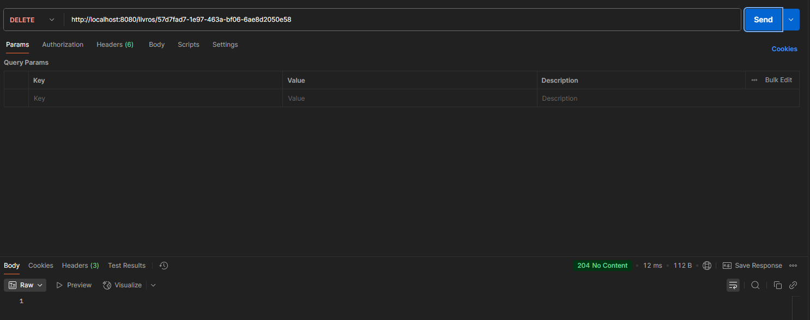

# Livros API

## Descrição
A **Livros API** é uma API para gerenciar um catálogo de livros.  
Permite listar, buscar, adicionar, atualizar e deletar informações sobre livros de forma simples e organizada.

---

## Tecnologias
- Java
- Spring Boot
- Postman
- Banco de dados: H2 (h2-console)

---

## Instalação
1. Clone o repositório:
git clone https://github.com/Larissa-Galdino/Trabalho_backend.git

2. Abra o projeto no IntelliJ.
Teste da aplicação no IntelliJ e Postman
A API possui os seguintes endpoints e métodos:
3. Método Endpoint Descrição
    - POST /livros/lista	Salva uma lista de livros no banco de dados
    - GET /livros	Lista todos os livros ou busca por nome
    - GET /livros/{id}Busca um livro pelo ID
    - PUT /livros/{id}Atualiza um livro pelo ID
    - DEL /livros/{id}Deleta um livro pelo ID

3. Rodar a aplicação No IntelliJ, execute a classe principal: LivrosAppApplication
No Body (raw JSON), insira a lista abaixo para salvar os livros no banco de dados:

[
{
"nome": "The Battle of the Apocalypse (A Batalha do Apocalipse)",
"autor": "Eduardo Spohr",
"preco": 45.9
},
{
"nome": "Children of Eden – Filhos do Éden",
"autor": "Eduardo Spohr",
"preco": 39.9
},
{
"nome": "A Marca de Atena (The Mark of Athena)",
"autor": "Rick Riordan",
"preco": 59.9
},
{
"nome": "Diário de um Nerd – Vol. 1",
"autor": "Philip Osbourne",
"preco": 54.9
},
{
"nome": "Fundação (Foundation)",
"autor": "Isaac Asimov",
"preco": 29.9
}
]

4. Buscar livros (GET) :

- Para listar todos os livros:
- GET http://localhost:8080/livros

- Para buscar por nome específico:
- GET http://localhost:8080/livros?nome=NomeDoLivro
- Se for especificado um nome, a API retornará apenas os livros correspondentes. 

5. Buscar livro por ID (GET)
- GET http://localhost:8080/livros/{id}
- Substitua {id} pelo ID do livro que deseja remover.

6. Atualizar livro (PUT)
   PUT http://localhost:8080/livros/{id}
No Body (raw JSON), envie os dados atualizados, incluindo o ID. Exemplo:
   {
   "id": "05e4605f-1274-448c-b31a-b03f094247fd",
   "nome": "The Battle of the Apocalypse (A Batalha do Apocalipse)",
   "autor": "Eduardo Spohr",
   "preco": 45.9
   }

7. Deletar livro (DEL)
   DEL http://localhost:8080/livros/{id}
   Substitua {id} pelo ID do livro que deseja remover.

## Observações

Certifique-se de que a aplicação esteja rodando antes de enviar requisições pelo Postman.
O H2-console pode ser acessado para verificar os dados salvos:

http://localhost:8080/h2-console

## Senha de Acesso ao Banco de Dados
    
- username: sa
- password: 1234
